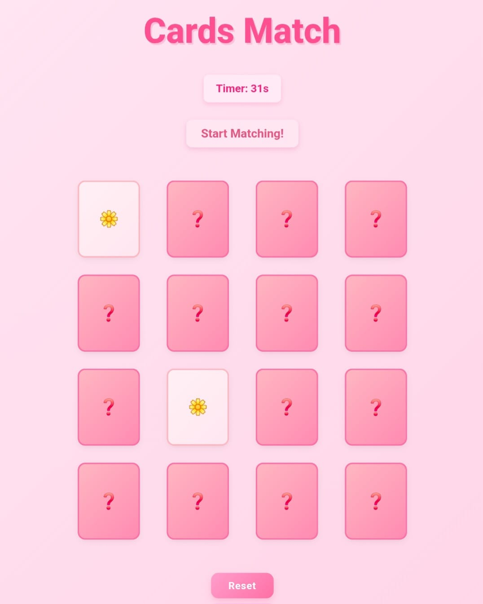

Cards Match

🎮 “Test your memory, match the emojis!”
A fun, interactive browser-based memory card game where players flip cards to find matching emoji pairs under a countdown timer.

Status

✨ Overview
Cards Match challenges players to find all matching emoji pairs in 1 minute. Each game session presents a shuffled board of 16 cards (8 pairs), testing memory and concentration skills. Users can restart anytime and try to improve their speed and accuracy.

🌐 Live Deployment
👉 Play Cards Match Live: https://emojimemorycardsgame.surge.sh

🖼️ Preview

Game Board – Flip and match emoji cards

Countdown Timer – Track your progress in real-time

Reset Button – Start a new game instantly

📐 Wireframes

🌟 Features
🎨 Interactive Gameplay

Flip cards to find matching pairs.

Smooth animations and immediate feedback for matched/unmatched pairs.

⏱️ Countdown Timer

60-second timer to challenge speed and memory.

Game ends when all pairs are matched or timer reaches zero.

🔄 Game Restart

Reset button reshuffles the cards and restarts the timer.

Allows endless replayability for practice and fun.

🛠️ Tech Stack

HTML, CSS, JavaScript

🔮 Future Improvements

Multiple difficulty levels (more cards, less time)

Leaderboard to track high scores

Mobile-friendly responsive design

Additional themes or emoji packs
